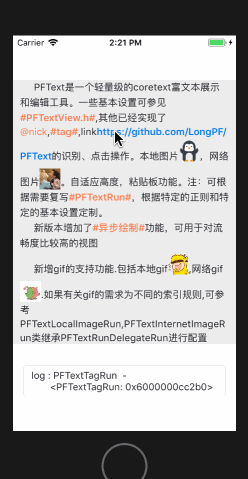

PFText
==============
&nbsp;
&nbsp;
&nbsp;
&nbsp;

一个轻量级的coretext富文本展示和编辑工具。

特点
==============
可以**自定义**筛选规则而不需要操作coretext代码

一些属性和方法介绍
==============

PFTextView(属性、方法)  |  说明
--------------------- | -------------
text 				   	  | 要绘制的文本
textColor  			  | 字体颜色
font					  | 字体
**settingRuns** 		  | **设置文本的样式,可以根据需要自定义 PFTextRun 添加到数组中** [详情](https://github.com/LongPF/PFText/blob/master/PFText/PFTextView.h) [demo](https://github.com/LongPF/PFText) 
delegate  			  | 回调触摸事件的代理
numberOfLines 		  | 行数,设置为0则不限制行数, 默认为0
lineBreakMode			  | 换行模式
textAlignment			  | 对齐方式
lineSpacing   		  | 行间距,默认为2
paragraphHeadIndent   | 段落前缩进
paragraphTailIndent   | 段落尾缩进,值应该为负值
firstLineHeadIndent   | 首行缩进
**heightThatFit:**    | 获取一个最适合的高度,不会改变自身的高度
**heightToFit**  	  | 该方法会调用heightThatFit:,传入width = self.bounds.size.width, 该方法会改变自身的高度

安装
==============
### CocoaPods
`pod 'PFText'`

### 手动
将**PFText**文件夹拖到项目中

已经实现的功能
==============

* @nick 
*  #tag# 
* link
* 本地图片
* 网络图片
* 点击事件
* 粘贴板

效果
==============

